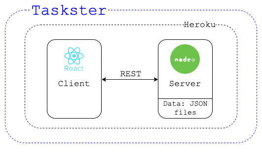
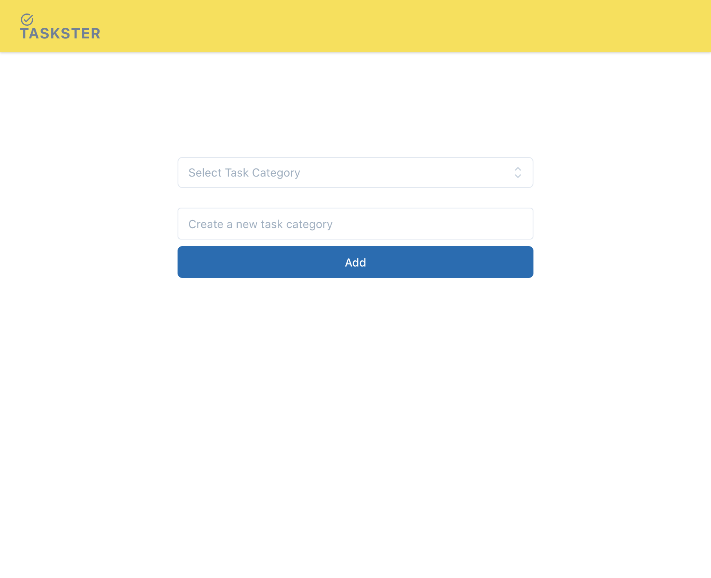
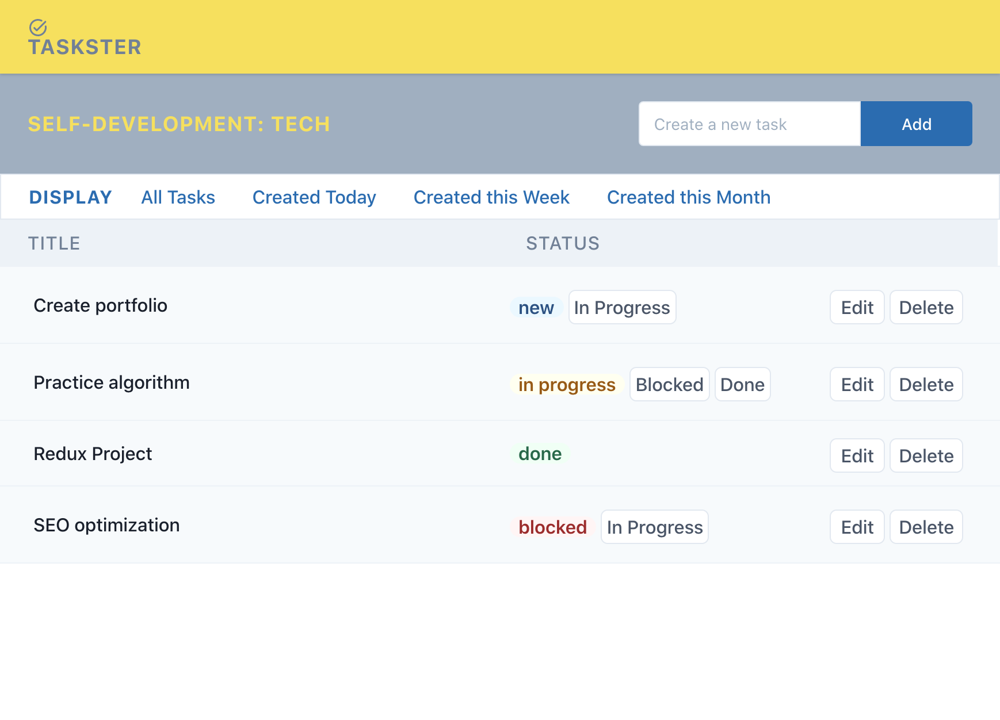

# `Taskster`

Task manager web application. User is able to: group tasks in different categories, manage the status of each task between `new` - `in progress` - `blocked` - `done`, sort tasks by time marker: created `today` / `this week` / `this month`.

Deployed to Heroku: https://taskster-app.herokuapp.com. Deployment to Heroku is triggered each time a new commit is pushed to the main branch. 

## Technologies and libraries used: 

 - Server - [Node](https://nodejs.org), [Express](https://expressjs.com)
 - Data is stored on server filesystem in JSON files
 - Client Framework - [React](https://reactjs.org)
 - Styles - [Tailwind CSS](https://tailwindcss.com)
 - ID generator - [shortid](https://www.npmjs.com/package/shortid)

## Architecture: 

## Implementation specifics: 
- Logs are stored in the filesystem and the file size isn’t controlled.
- User management is out of scope, the application works in “single user mode”.

## Planned Improvements:
- Maybe try to use DB.

## Main interaction scenarios as GIFs:

## Screenshots:

### Desktop (macOS, Chrome):

  
  

### Mobile (iOS, Chrome):

  
   

